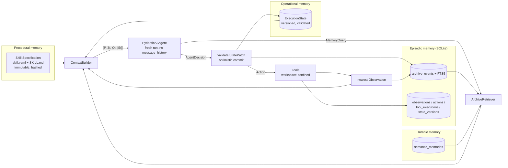

# Class-W Mnestic

*In SCP lore, a Class-W mnestic grants permanent immunity to forgetting. This runtime is built on the same premise: the agent never truly loses what it has seen — it just stops carrying all of it around.*

**Class-W Mnestic** (Python package and CLI: `mnestic`) is a long-horizon autonomous agent runtime built on
**PydanticAI**, **pydantic-graph**, **Pydantic** and **SQLite**, implementing the
architecture of *SKILL.state: Scalable Long-Horizon Agent Skills*
(Badhe, Tiwari, Chung — [arXiv:2608.26263](https://arxiv.org/abs/2608.26263)).

Its one defining property:

> **At each ordinary reasoning step the model receives the current execution state,
> not an accumulating execution transcript.**

Every step is a fresh, bounded model call built from four things — the immutable
**Skill Specification**, the canonical **Execution State**, the **newest Observation**,
and (only if the agent explicitly asked for it) **retrieved archival evidence**. Old
observations, old actions and the model's own reasoning never come back by default. They
are preserved in an append-only SQLite **archive** that the agent can query on demand.

**THE ARCHIVE IS NOT DEFAULT MODEL CONTEXT.**

## Why this is different from a chat-history agent

| | chat-history / ReAct agent | Class-W Mnestic |
|---|---|---|
| working memory | the message list | a validated `ExecutionState` (Pydantic) |
| what step *t* sees | everything since step 0 | skill + state + newest observation |
| per-step prompt size | grows with *t* | bounded by state size (policy-limited) |
| stale facts | stay in the transcript forever | replaced via `supersede_fact`; old value archived |
| forgotten details | lost when truncated/summarized | recoverable with an explicit `MemoryQuery` |
| reasoning traces | re-sent every step | discarded after the validated state update |
| crash recovery | replay the transcript | reload state + step phase from SQLite |
| auditability | read the transcript | `history`, `diff`, `events`, `inspect-context` |

The 300-step benchmark in `tests/benchmarks` shows the Class-W Mnestic context flat at
~3.3K chars while the simulated transcript agent passes 175K chars; the archive grows
linearly, the prompt does not. See `docs/BENCHMARK_REPORT.md`.

## Architecture



The lifecycle is a pydantic-graph state machine
(`uv run mnestic graph` renders it):

```
Enter → BuildContext → Reason → ApplyDecision → { RetrieveMemory | ExecuteAction | AwaitHuman | Finalize }
        RetrieveMemory → BuildContext          ExecuteAction → CaptureObservation → BuildContext
        Reason/ApplyDecision → HandleFailure → BuildContext | Finalize
```

Two kinds of state exist and are deliberately separate:

- `ExecutionState` (`models/state.py`) — the semantic, model-facing state: objective,
  phase, verified facts (with evidence event ids), hypotheses, rejected hypotheses,
  environment, plan, artifacts, blockers, questions, entities, counters, budgets.
  Durably versioned; mutated only through validated `StatePatch` ops.
- `RuntimeGraphState` (`graph/state.py`) — ephemeral controller bookkeeping for one
  process invocation (current step, pending decision, tool result). Never rendered.

More in `docs/ARCHITECTURE.md`, `docs/STATE_MODEL.md`, `docs/CONTEXT_INVARIANTS.md`.

## Quickstart

```bash
uv sync
uv run mnestic doctor
uv run mnestic skills list

# deterministic example, no model needed
uv run mnestic run deterministic-counter --task "count to 5" --model mock

# realistic multi-step research skill, scripted (mock) reasoner
mkdir -p /tmp/demo/src && printf 'PORT = 8000\n' > /tmp/demo/src/app.py
uv run mnestic run codebase-research --task 'Where is `PORT` configured?' --model mock --workspace /tmp/demo

# with a real model (any PydanticAI provider string)
export OPENAI_API_KEY=...            # or ANTHROPIC_API_KEY, etc.
uv run mnestic run codebase-research --task 'Where is `PORT` configured?' --model openai:gpt-4o-mini --workspace /tmp/demo
```

A local OpenAI-compatible server works too: `OPENAI_BASE_URL=http://localhost:8080/v1 OPENAI_API_KEY=x --model openai:my-model`.

## Example run

```
$ uv run mnestic run codebase-research --task 'Where is `PORT` configured?' --model mock --workspace /tmp/demo --json
{
  "run_id": "run_df94610f02909e01",
  "status": "completed",
  "reason": "completed",
  "summary": "report written",
  "steps": 5,
  "state_version": 11,
  "completion": {
    "outcome": "success",
    "final_answer": "workspace root contains: src; the term PORT appears in the workspace; PORT occurs in 1 line(s); first in src/app.py; ...",
    "artifact_ids": ["art_report"]
  }
}
```

## Inspecting state

```bash
uv run mnestic status                      # all runs
uv run mnestic status <run-id>             # run metadata + metrics
uv run mnestic state <run-id> --model-view # EXACTLY what the model sees as state
uv run mnestic state <run-id> --version 3  # any historical version
uv run mnestic history <run-id>            # every version, the patch that produced it, rejected patches
uv run mnestic diff <run-id> 3 7           # structural diff between two versions
```

## Inspecting the archive and the model context

```bash
uv run mnestic events <run-id> [--type tool.finished] [--step 4] [--payload]
uv run mnestic memory search <run-id> "server_port"            # FTS5 keyword search
uv run mnestic memory search <run-id> --type state_history
uv run mnestic inspect-context <run-id> --step 4               # the exact context sent at step 4
uv run mnestic inspect-context <run-id> --next                 # what WOULD be sent next
uv run mnestic inspect-context <run-id> --step 4 --sections    # section by section
```

`inspect-context` prints the stored `ModelContext` (instructions + prompt) byte-for-byte
as it was handed to PydanticAI, with `<skill_specification>`, `<execution_state>`,
`<latest_observation>` and (only when requested) `<retrieved_archival_evidence>` sections.

## Resuming a run

```bash
uv run mnestic resume <run-id>                       # after a crash, pause, or --max-steps
uv run mnestic resume <run-id> --input "use staging" # answer a RequestHumanInput
```

Resume reconstructs everything from SQLite: the current state, the latest step's
persisted phase (`observation_ready`, `context_built`, `decision_recorded`,
`state_committed`, `action_pending`, `action_dispatched`, `awaiting_human`, `done`) and
the pending observation. No transcript is replayed. See `docs/CRASH_RECOVERY.md` for the
exact guarantees (tool execution is *at-least-once*: a crash mid-tool yields an
`interrupted` observation, not a silent retry).

## Running tests

```bash
uv run pytest                 # 83 tests, no credentials, ~7 s
uv run pytest tests/benchmarks
uv run ruff check src tests && uv run mypy src
MNESTIC_LIVE_TESTS=1 MNESTIC_MODEL=openai:gpt-4o-mini uv run pytest tests/integration/test_live_model.py
```

## Benchmark

```bash
uv run python scripts/benchmark.py 1000    # writes docs/BENCHMARK_REPORT.md
uv run mnestic benchmark --steps 500
```

The benchmark runs the real runtime with a scripted reasoner and a mock tool that emits a
fixed-size observation carrying a unique marker per step; it fails if any older marker
appears in a later context, or if the late-run context size drifts more than 5%. A
ReAct-style transcript simulator provides the contrast.

## Configuration

Environment (`MNESTIC_*`) or CLI flags:

| variable | default | meaning |
|---|---|---|
| `MNESTIC_DB_PATH` | `.mnestic/mnestic.db` | SQLite file (WAL, foreign keys) |
| `MNESTIC_WORKSPACE` | cwd | tool sandbox root |
| `MNESTIC_SKILLS_DIRS` | `skills` | `os.pathsep`-separated skill roots |
| `MNESTIC_MODEL` | `mock` | PydanticAI model string, e.g. `anthropic:claude-sonnet-4-5` |
| `MNESTIC_OUTPUT_MODE` | `tool` | `tool` \| `native` \| `prompted` structured-output mode |
| `MNESTIC_MODEL_RETRIES` | `2` | in-step output validation retries |
| `MNESTIC_SHELL_MODE` | `allowlist` | `disabled` \| `allowlist` \| `unrestricted` |
| `MNESTIC_LOG_LEVEL` / `MNESTIC_LOG_JSON` | `INFO` / off | structured logging |
| `MNESTIC_LOGFIRE` | off | enable Pydantic Logfire if installed |

State-size limits (`StateLimits`) and the shell policy are in `config.py`.

## Security limitations

This is **not** safe for unattended execution with elevated privileges. Read
`docs/SECURITY.md`. In short: filesystem tools are confined to the workspace (path and
symlink resolution), the shell tool defaults to an argv allowlist with no shell
interpretation and a minimal environment, tool output is treated as untrusted data and
bounded before it reaches the model, and everything the model produces is validated —
but prompt injection through retrieved files or archive content can still steer the
agent within those boundaries.

## Roadmap

See the staged roadmap in `docs/ARCHITECTURE.md#roadmap` (semantic retrieval, richer
tools, MCP, subagents, self-improving versioned skills). Every stage is evaluated
against one question: *does this preserve current-state-based reasoning, or does it turn
the agent back into a giant conversation?*
